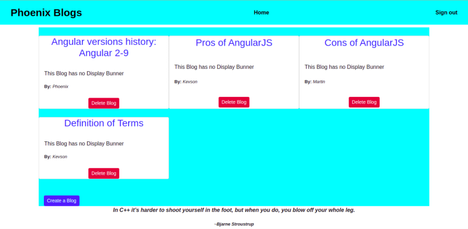
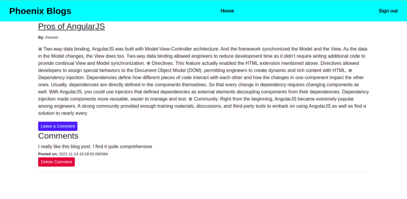
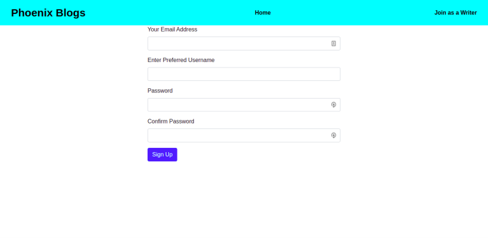
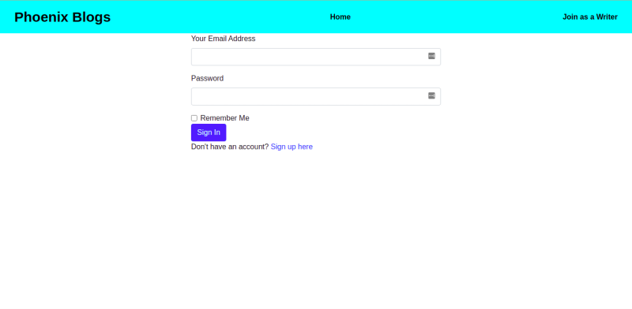

# Phoenix Blogs

# Author
Built by: Nyambura Njuguna

# Description
This is a web application where users can visit to view blogs related to web development and leave comments. Blog writers can log in to the application to post blogs, delete blogs, and delete unwanted comments.

## User Story
The user can:
* View the blog posts on the site
* Comment on blog posts
* Receive an email alert when a new post is made by joining a subscription.
* See random quotes on the site

The writer can:
* Sign in to the blog.
* Create a blog from the application.
* Delete comments that I find insulting or degrading.
* Update or delete blogs I have created.

# Design
### Home page

### Blog Content Page

### Sign up page

### Login page

# Prerequisites
* python3.9
* pip
* Flask

# Cloning
Open Terminal:

  $ git clone https://github.com/Kevson102/Phoenix-Blogs.git
  $ cd Pitches
  $ code . or atom . based on your text editor 
  
# Install all dependencies in requirements.txt

  $ pip install -r requirements.txt
  
# Running the Application
To run the application, open the cloned repo in terminal and run the following commands:

  $ ./chmod a+x manage.py
  $ ./manage.py

# Technologies Used
python 3.9
Flask_Bootstrap4 - for bootstrap version 4
Heroku - online deployment

Support and contact details
Incase of any issues at hand, please email me at kevson3941@gmail.com

# License
MIT License.
